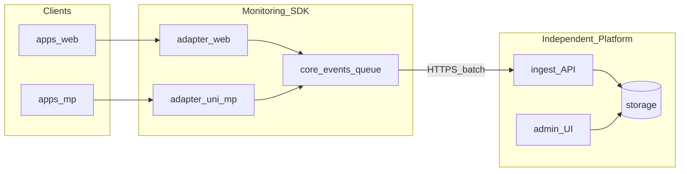

> **后续规划**：Phase B/C 与 MVP 之后的大版本范围以 **[monitoring-v2-需求规格.md](./monitoring-v2-需求规格.md)** 与 **[monitoring-v2-路线图.plan.md](./monitoring-v2-路线图.plan.md)** 为准，本文档保留为 Phase A 基线说明。

# 跨 Web / 小程序监控 SDK 与独立平台方案

## 背景与约束

- 当前 [apps/web/src/main.ts](apps/web/src/main.ts)、[apps/mp/src/main.ts](apps/mp/src/main.ts) 未接入任何监控；服务端无 telemetry 路由。
- Web：Vue 3 + Vite；小程序：uni-app（[apps/mp/package.json](apps/mp/package.json) 含多 MP 平台包，实现时以 **微信小程序 + uni H5** 为首要验证目标，其它 MP 通过同一抽象逐步扩展）。
- 你已确定 **SDK、接收服务、管理可视化** 三者独立；本计划把 **SDK 落盘位置** 定为 monorepo 内可发布的 `packages/*`（后续可拆仓或单独 npm），**接收端与管理台** 以独立工程描述接口契约与 MVP 范围（是否建在 `apps/monitoring-*` 由你们定，不绑定 Shipyard 业务库）。
- 团队规模可支撑当前 **Phase A～C** 划分，无需再压缩为「仅 ingest + 临时查库」型 MVP。

## 总体架构

## 一、SDK 分层设计（兼容 Web + 小程序）

### 1.1 包形态建议

- 新建 **`packages/monitoring-sdk`**（名称可调整），建议 **子路径导出**：
  - `@shipyard/monitoring-sdk/core`：类型、事件 schema、队列、批量上报、采样、脱敏、插件接口。
  - `@shipyard/monitoring-sdk/web`：依赖浏览器 API 的采集与 `transport`（`fetch` / `sendBeacon`）。
  - `@shipyard/monitoring-sdk/uni`：基于 **条件编译 + 运行时探测** 的 uni/微信实现（`uni.request` / `wx`），避免在 core 中引用 `@dcloudio/*`。

Core 只依赖 **TypeScript 标准能力**；平台包可依赖 `vue` 的 **可选** Vue 插件（`app.config.errorHandler`、router afterEach），放在 `web` / `uni` 各自入口，避免小程序包体积无谓增大。

### 1.2 统一事件模型（覆盖前述各类场景）

用 **少数字段 + `type` 枚举 + `payload`** 扩展，便于接收端入库与看板聚合：

| 场景 | `type` 建议 | Web 采集要点 | 小程序 / uni 采集要点 |
|------|-------------|--------------|------------------------|
| JS 错误 | `error` | `window.onerror`、`unhandledrejection`、Vue `errorHandler` | `wx.onError`、`onUnhandledRejection`（或 uni 封装）、Vue `errorHandler` |
| 资源失败 | `resource_error` | `PerformanceObserver` resource / `error` 事件补充 | 受限：可上报 **请求失败**（见下行）与 **图片加载失败**（若业务埋点） |
| 接口 / 网络 | `http_error` / `http_slow` | 包装 `fetch`/axios 拦截器或 PerformanceResourceTiming | `uni.request` / `wx.request` 封装，`fail`、status、耗时 |
| 性能 RUM | `web_vital` / `timing` | `web-vitals` 或 `PerformanceObserver`（LCP、INP、CLS、FCP、TTFB） | 无等价 Web Vitals：用 **自定义阶段计时**（冷启动、首屏、setData 前后）、微信性能相关 API（在合规与版本允许范围内）做 **best-effort** |
| 白屏 / 关键渲染 | `healthcheck` | 首屏后检测根节点 / 关键 selector + 超时阈值 | 首屏 onReady + 关键数据就绪标记 |
| 会话与发布 | 每条事件公共字段 | `sessionId`、`release`、`env`、`route` | 同左；路由用 **页面 path + query 脱敏** |
| 业务与漏斗 | `custom` | `track(name, props)` | 同 API，注意小程序包体与审核敏感字段 |

公共字段（所有事件）：`eventId`、`timestamp`（客户端生成，**仅作参考**）、`platform`（`web` \| `mp-weixin` \| `uni-h5`…）、`sdkVersion`、`release`、`env`、`userId`（哈希化可选）、`sessionId`、`route`、`device`（抽象：型号、系统、微信版本/浏览器 UA 摘要）、`network`（若可得）、`sampleRate`。

**面包屑（Phase A，与管理台 MVP 对齐）**：SDK 提供 `addBreadcrumb({ category, message, data? })`，core 内 **环形缓冲**（条数上限、单条体积上限）；`error` 上报时在 payload 中附带最近 N 条 breadcrumb，避免管理台「有面包屑文案却无采集」的预期落差。

### 1.3 传输与可靠性

- **批量队列**：内存队列 + `flush` 定时器；页面卸载 Web 用 `sendBeacon`/`fetch keepalive` 尽力发送。
- **小程序**：`uni.request` 短连接批量；小程序后台策略下接受 **丢采样**，重要错误可提高优先级单独发。
- **鉴权**：`projectKey` / `ingestToken`（仅作识别与限流，非用户密码）；HTTPS 必选。RUM 场景 token 可能暴露于前端，须 **按 project 配额 + IP/指纹限流** 接受滥用面，文档中明确勿将高敏密钥与 ingest token 混用。
- **脱敏**：URL query、请求体、自定义 props 走可配置 **key denylist + 截断**；默认 redact。

**持久化队列（Phase B+，可选）**：在内存队列之上增加 Web **IndexedDB**（或 session 级降级）、小程序 **本地存储** 的离线补发；须单独约定 **容量上限、保留时长、敏感数据不落盘**，避免与隐私政策冲突。

### 1.4 接入方式（与现有应用对齐）

- **Web**：在 [apps/web/src/main.ts](apps/web/src/main.ts) 初始化 `initWebMonitoring({ dsn, release, ... })`，注册 Vue 插件与（可选）axios 实例。
- **uni**：在 [apps/mp/src/main.ts](apps/mp/src/main.ts) 的 `createApp()` 后初始化 `initUniMonitoring(...)`；提供 **request 包装器** 供业务统一使用以自动带 `http_*` 事件。
- **Monorepo 衔接**：根目录 [pnpm-workspace.yaml](pnpm-workspace.yaml) 已包含 `packages/*`；新包自带 `tsconfig`，`apps/web`、`apps/mp` 在 `package.json` 中 `workspace:*` 依赖即可。根 [tsconfig.json](tsconfig.json) 可不包含 `apps/mp`，不影响 SDK 消费。

### 1.5 Web 跨域与 CSP

- 若上报域名与业务站点 **不同源**，Ingest 须配置 **CORS**（预检与 `POST` 放行），并在集成文档中要求业务侧 **CSP `connect-src`** 包含 ingest 域名，否则会出现 **静默丢上报**。
- OpenAPI / 接入手册中写明推荐响应码、body 大小限制与 CORS 头示例。

## 二、独立监控服务端（Ingest）

- **职责**：鉴权、限流、payload 校验（zod/json-schema）、批量写入存储、异步消费（可选队列）。
- **API 契约（建议）**：`POST /v1/ingest/batch`，body 为事件数组；响应 `202` + `accepted`/`rejected` 计数；文档化 **单条大小上限** 与 **字段白名单**。
- **服务端时间**：每条入库记录写入 **`receivedAt`（服务端 UTC）**；统计、告警、SLA 以 `receivedAt` 为准；客户端 `timestamp` 仅用于辅助排查时钟漂移。
- **去重 / 幂等**：客户端生成 **`eventId`（建议 ULID/UUID）**；ingest 对 **`(projectKey, eventId)`** 做去重（或同批次内先去重），避免重试导致错误率与事件量虚高。
- **存储**：MVP 可用 PostgreSQL/ClickHouse/OpenSearch 择一；错误全文与堆栈需 **保留原文 + 符号化任务异步**（source map 上传独立接口 `POST /v1/sourcemaps`）。
- **与 Shipyard 无关**：不耦合业务用户体系；若需关联用户，仅接收 **opaque id**。

## 三、独立管理 / 可视化平台

- **MVP**：按 `release`、`route`、`platform` 维度的错误率、P95 耗时、事件列表与详情（堆栈、**breadcrumb**，与 SDK Phase A 一致）。
- **进阶**：Web Vitals 看板（仅 Web）、告警规则、source map 符号化展示、漏斗分析（基于 `custom`）。

## 四、分阶段交付（建议）

1. **Phase A**：`core` 队列 + 批量 + 脱敏 + **breadcrumb 环形缓冲** + `web` 错误 + `uni` 错误 + Ingest 最小实现（含 `receivedAt`、去重、限流）+ DB 落库 + 管理台列表页（含面包屑展示）。
2. **Phase B**：Web Vitals + 资源失败；小程序自定义 timing + request 封装；管理台基础图表；**可选** 持久化队列（见 1.3）。
3. **Phase C**：source map 上传与符号化、采样策略精细化、告警。

## 五、风险与差异说明（需在文档中写清）

- 小程序 **无法** 与浏览器完全对等的 Web Vitals；对外产品话术应写 **「Web 全量 RUM + 小程序最佳努力性能指标」**。
- 微信隐私与审核：避免采集未声明的个人信息；自定义字段需可配置关闭。
- **独立三仓或三目录** 时，保持 **OpenAPI / 共享 JSON Schema**（可放在单独 `monitoring-contracts` 小包）避免 SDK 与服务端漂移。

## 六、测试与质量

- **core**：单测覆盖队列 flush、采样率、脱敏规则、批量切片；transport 使用 mock，不触网。
- **小程序**：构建产物关注 **包体与 tree-shaking**；避免将 web-only 代码打入 MP（子路径导出 + 条件编译）。

## 七、验收清单（SDK + 接入）

- Web：能上报未捕获异常、Promise 拒绝、Vue 渲染错误、至少一项 Web Vital、接口错误（通过拦截器）；预发/生产开启或采样策略符合配置。
- 小程序：能上报 JS 错误、请求失败、页面路径与 release；冷启动到首屏可配置打一条 `timing`。
- **breadcrumb**：连续操作后触发错误，管理台详情可见最近 N 条面包屑。
- 同一批事件在管理台可按 `platform` 过滤且 schema 一致；ingest 侧 **`receivedAt` 可查、重复 `eventId` 不重复计数**（或按产品定义合并展示）。
