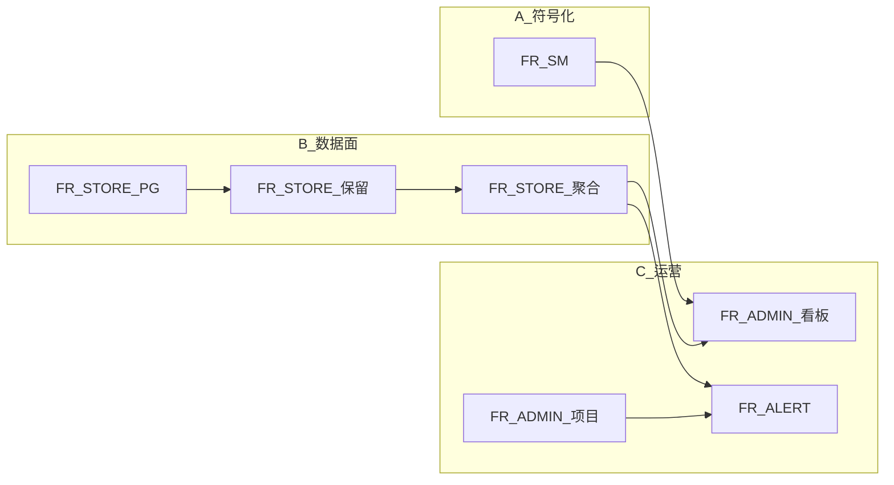

# Shipyard 监控子系统 v2 路线图

## 关联文档

- **需求规格（验收依据）**：[monitoring-v2-需求规格.md](./monitoring-v2-需求规格.md)
- **历史方案（Phase A 基线）**：[monitoring-sdk-三端方案.plan.md](./monitoring-sdk-三端方案.plan.md)

## 版本定位

- **基线**：当前 MVP（SQLite、Ingest、管理台列表/JSON 详情、SDK 三端、501 sourcemaps）。
- **v2 主题**：**可符号化排查**、**PG 与保留/聚合**、**运营看板**、**独立项目与 Token**、**企微/飞书告警**；**不与 Shipyard 业务库绑定**。

## 主线与依赖（摘要）

- **A（FR-SM）** 与 **B（FR-STORE）** 可并行。
- **C** 中看板依赖 **预聚合**；告警依赖 **规则存储** 与 **可观测事件流或聚合结果**（实现可选用定时扫聚合表触发）。

## 里程碑建议

| 阶段 | 重点 |
|------|------|
| **v2-alpha** | FR-STORE-001/002/003 + FR-CONTRACT 文档；PG 可部署 |
| **v2-beta** | FR-SM 全链路 + FR-ADMIN-002 详情符号化 |
| **v2-rc** | FR-STORE-004 + FR-ADMIN-001/003 + FR-ALERT-001/002/003 + 第 9 节验收 |

## 修订记录

| 日期 | 说明 |
|------|------|
| 2026-04-12 | 初稿，与 monitoring-v2-需求规格 v1.0 互链 |
