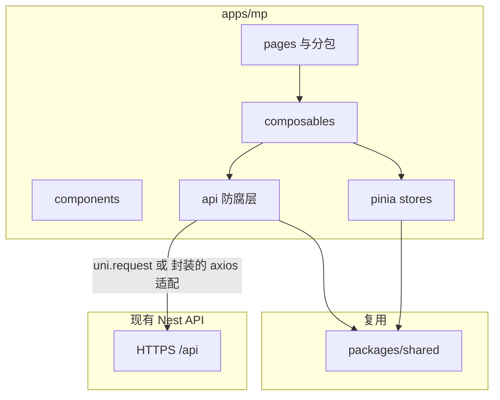

> **关联需求规格**：[shipyard-uni-app-mp-需求规格.md](./shipyard-uni-app-mp-需求规格.md)（FR/NFR/验收以该文档为准）。  
> **文档位置约定**：本项目计划与需求仅存放于仓库 `.cursor/plans/`，勿将副本放在全局 `~/.cursor/plans`。

# Shipyard Web → uni-app 小程序（全量对齐）实施计划

## 基线与范围

- **Web 参考**：[apps/web](apps/web)（Vue 3 + Vite + Pinia + TanStack Vue Query + Naive UI + axios + vue-router + vue-i18n）。路由清单见 [apps/web/src/router/index.ts](apps/web/src/router/index.ts)（认证 4 页、个人设置、组织列表、组织内仪表盘/项目/环境/部署详情/服务器/团队/审批/Git 账户/组织设置等）。
- **目标**：新建 **apps/mp**（或 `apps/mini-program`，下文统称 `apps/mp`），**功能与信息架构与 Web 对齐**，优先 **微信小程序**；其它端通过 uni-app 条件编译逐步打开。
- **架构原则**：延续仓库内 [ddd-frontend Skill](.cursor/skills/ddd-frontend/SKILL.md)：**页面 → composables/用例 → `api/*` → HTTP**；服务器状态 TanStack Query，会话 Pinia；DTO 映射不进模板。UI 不沿用 Naive，采用 **Wot Design Uni + UnoCSS（unocss-applet）**（与常见 uni-app 组件库实践一致；个人可参考本机 `vue-uniapp-frontend` Skill，**勿在计划正文绑定 `~/.cursor` 路径**以免协作者无法打开）。
- **登录与账号（首版定案）**：与 Web **一致**——**邮箱/密码注册登录 + JWT**（`accessToken` / `refreshToken`），**首版不做**微信一键登录 / 手机号授权；若未来要做，单独立项。

## 工程与仓库结构

1. **pnpm workspace**：已在 [pnpm-workspace.yaml](pnpm-workspace.yaml) 包含 `apps/*`，新增 `apps/mp` 即可被安装与脚本统一调度。
2. **脚手架**：使用官方 **uni-app + Vue3 + Vite + TypeScript** 模板（CLI 或 `pnpm create uni-app`，以当前 uni-app 文档为准），保证 `pnpm --filter @shipyard/mp build:mp-weixin` 一类脚本可本地与 CI 复现。
3. **根目录脚本**：在仓库根 [package.json](package.json) 增加便捷入口，例如 `dev:mp`、`build:mp-weixin`（转发到 `@shipyard/mp`），与现有 `dev:web` 并列。
4. **CI 预期**：**首版以本地构建 + 微信开发者工具上传体验版为主**；向微信平台 **miniprogram-ci** 自动上传依赖私钥与流水线密钥治理，列为**可选**，不阻塞全量对齐交付。
5. **包名建议**：`@shipyard/mp`，`private: true`，与 [apps/web/package.json](apps/web/package.json) 对齐版本号策略。
6. **依赖**（与 Web 对齐能力，替换不兼容库）：
  - **状态**：`pinia`、`@tanstack/vue-query`
  - **HTTP**：推荐薄封装 **uni.request**（小程序域名校验、更稳）；若坚持用 axios，需验证各端构建与 TLS；拦截器逻辑对照 [apps/web/src/api/client.ts](apps/web/src/api/client.ts)（Bearer、`/auth/refresh` 队列与重试）。
  - **存储**：`accessToken` / `refreshToken` 用 `uni.setStorageSync`，抽象 `storage` 模块便于测试。
  - **UI**：Wot Design Uni；样式 UnoCSS + `unocss-applet`（按 Skill）。
  - **国际化**：继续 `vue-i18n`，消息可从 [apps/web/src/i18n/messages](apps/web/src/i18n/messages) 迁出共用或阶段性复制后合并。
7. **与 `@shipyard/shared` 的关系**：枚举、文案 key、`buildNginxServerNameList` 等能共用的继续 **workspace 依赖**；**不要**把 Web 专用类型强塞进 shared，除非确属领域通用。
8. **双端维护预期**：**短期**在 `apps/web/src/api` 与 `apps/mp` 下 **各维护一套** HTTP 模块，**目录与命名镜像**；**中期**再评估抽取 `packages/api-client` 或 OpenAPI 生成（非首版阻塞）。
9. **配置安全**：包内**禁止**嵌入生产密钥；仅构建期注入 **API Base URL** 等非敏感项；敏感凭据仍来自用户登录后的 JWT 与后端。

## 路由与页面映射（全量对齐）

用 **pages.json 主包 + 分包** 对应 Web 结构（避免首包过大）：

| Web 路径                                                    | 小程序建议                                                                    |
| --------------------------------------------------------- | ------------------------------------------------------------------------ |
| `/login` `/register` `/forgot-password` `/reset-password` | 主包 `pages/auth/*`                                                        |
| `/settings`（个人）                                           | 分包 `packageSettings`                                                     |
| `/orgs`                                                   | 主包或分包 `pages/orgs/list`                                                  |
| `/orgs/:orgSlug` 及子路由                                     | 分包 `packageOrg`，路径参数 `orgSlug` + `projectSlug` / `deploymentId` 与 Web 一致 |

组织内子页与 Web 一一对应：`dashboard`、`projects`（列表/新建/详情）、`environments`、`deployments/:id`、`servers`、`team`、`approvals`、`git-accounts`、`settings`（组织）。

**导航模式（默认）**：Web 侧栏在小程序侧用 **页面栈 + 自定义导航栏**（标题区 + 返回）对齐 [AppLayout](apps/web/src/components/layout/AppLayout.vue) 的「顶栏返回 + 内容区」体验；**首版不强制** `tabBar` 映射侧栏（模块多、微信 tab 仅 5 个）。若后续要固定入口，可对 **仪表盘 / 项目 / 审批** 等子集做 `tabBar`，其余仍走列表或宫格入口。

**组织上下文**：Pinia（对齐 [apps/web/src/stores/org.ts](apps/web/src/stores/org.ts)）保持 `currentOrgSlug`，进入组织分包前校验。

## API 与鉴权复刻

1. **目录**：镜像 [apps/web/src/api](apps/web/src/api)（`auth`、`orgs`、`projects`、`environments`、`dashboard`、`servers`、`team`、`approvals`、`git-accounts`、`kubernetes-clusters`、`feature-flags`、`pipeline`、`settings`、`users` 等），**方法签名与 Web 对齐**，内部改为 `request()`。
2. **Base URL**：禁止写死 Web 的 `baseURL: '/api'`。使用 **构建期环境变量**（如 `VITE_API_BASE=https://your-api.example.com/api`），并在文档中说明微信小程序后台配置 **request 合法域名**、**socket 合法域名**（若使用原生 WebSocket）。
3. **401 / refresh**：复刻 [apps/web/src/api/client.ts](apps/web/src/api/client.ts) 与 [apps/web/src/stores/auth.ts](apps/web/src/stores/auth.ts) 的刷新队列行为，避免并发登录风暴。小程序无浏览器 Cookie，**refresh 仅依赖 storage 中的 token** 与请求头/Body，行为与 Web 对齐即可。

## 网络与域名（小程序 ≠ 浏览器 CORS）

- **HTTPS**：微信要求请求与 WebSocket 使用 **HTTPS / WSS**；后端须以 **公网可解析域名** 暴露 API（开发阶段可用真机调试/合法域名配置，**不能**依赖 `localhost` 进正式包）。
- **合法域名**：与浏览器 **CORS** 无关；须在小程序后台配置 **request 合法域名**、**socket 合法域名**（若用实时日志）。业务上仍建议 Nest 侧保持现有 CORS/安全头，但**小程序是否通主要由微信域名校验决定**。
- **鉴权**：不在小程序依赖「同站 Cookie」；**Bearer JWT** 与 Web 一致。

## 按模块落地的实现要点（高风险项单独处理）

### 1. 部署详情页（[DeploymentDetailPage.vue](apps/web/src/pages/pipeline/DeploymentDetailPage.vue)）

- **Socket 实时日志**：Web 使用 `socket.io-client`（`io({ auth: { token } })`）。小程序端需 **二选一**（建议在计划中先定案，再开发）：
  - **A（推荐调研优先）**：继续使用 **socket.io 官方客户端**，验证微信小程序是否允许该连接方式及是否需要 `wss` + 合法域名；若受限，则
  - **B**：后端增加 **仅用于小程序的日志轮询或 SSE/纯 WebSocket** 接口（工作量在后端，需单独排期）。
- **xterm**：小程序 **无终端模拟器**；对齐产品表现为 **只读日志列表**（虚拟列表 + 自动滚动），不承诺完整终端交互。
- **ECharts**：使用 uni-app 生态兼容方案（如 `lime-echart` 等），仪表盘与统计图与 Web 视觉接近即可。

### 2. 表单与表格密集页

- 服务器、环境模态框、项目编辑、组织设置等：用 Wot Design Uni 的 `Form` / `Field` / `Popup` / `ActionSheet` 等组合实现；复杂表格改为 **卡片列表 + 筛选** 或 **横向滚动表格**（小程序体验限制下接受布局差异，但 **字段与操作与 Web 对齐**）。

### 3. 文件与剪贴板

- 若有「复制部署 ID / URL」：使用小程序 `setClipboardData` API。

## 分期合并策略（全量对齐但可逐 PR 合并）

建议按 **业务闭环** 拆 PR，降低评审风险：

1. **PR1 基建**：`apps/mp` 工程、根目录 `dev:mp` / `build:mp-weixin`、请求层、Pinia auth、环境变量、登录/注册/忘记密码/重置密码。
2. **PR2 组织与个人**：组织列表、Org 上下文、个人设置、仪表盘只读。
3. **PR3 项目域**：项目列表/新建/详情、环境页、关联 API 与 Query。
4. **PR4 流水线**：部署详情（含日志方案定案后的实时/轮询）、重试等与 [apps/web/src/composables](apps/web/src/composables) 中对 pipeline 的封装对齐；**PR4 启动前**完成 Socket **PoC**（见上节），避免返工。
5. **PR5 基础设施与治理**：服务器、团队、审批、Git 账户、组织设置（含 FeatureFlag / K8s 等若 Web 已有）。
6. **PR6 打磨**：i18n 全覆盖、暗色主题（若 Web 有）、分包体积与预下载、体验版与发布清单。

## 文档与运维

- 根目录或 [README.md](README.md) 增加小节：**小程序构建命令**、**合法域名**、**体验版测试号**、**API 必须为 HTTPS**、**类目与隐私合规提示**（与风险表「微信审核」呼应）。
- 若日志方案依赖 **新后端接口**，在 [CHANGELOG.md](CHANGELOG.md) 与 ADR 中简短记录。

## 验收标准（全量对齐）

- 与 [apps/web/src/router/index.ts](apps/web/src/router/index.ts) 对应的 **每一类功能**均有入口且核心 CRUD/只读行为与 Web 一致（在小程序交互约束下允许布局差异）。
- **鉴权**：token 过期刷新、登出清理存储、未登录跳转登录页。
- **微信小程序**：可上传体验版，主流程无白屏；无未配置域名导致的请求失败。

## 主要风险

| 风险             | 应对                                                      |
| -------------- | ------------------------------------------------------- |
| Socket 在小程序受限  | 提前 PoC；必要时后端提供轮询/WebSocket 简化协议                         |
| 分包体积           | 按组织分包 + 组件按需引入                                          |
| 与 Web 双端维护 API | 短期双份 `api/*` + 目录镜像；中期再抽共享层（见「工程与仓库结构」第 8 条） |
| 微信审核与类目 | 管理类小程序需选对类目、隐私协议与用户数据说明；上架前预留审核周期 |
