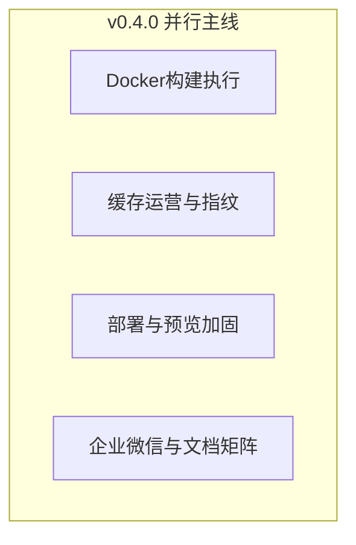

# Shipyard 下一主版本规划（v0.4.0）

## 基线与版本定位

- **基线**：[CHANGELOG.md](../../CHANGELOG.md) **0.3.0**（预览 SSR 蓝绿、SSH `[precheck]`、飞书/Slack secret、`node_modules` 指纹缓存、`SHIPYARD_BUILD_USE_DOCKER` 仅告警）。
- **v0.4.0 主题**：**Docker 构建隔离实装（opt-in）**、**构建缓存可运营**、**部署/预览可配置与 Nginx 一致性**、**通知扩展与自托管矩阵可验证**。
- **仍不承诺**：多区域 HA、审计日志、合规认证、完整 1.0 发布清单（延续 [shipyard-v0.3-需求规格.md](./shipyard-v0.3-需求规格.md) 边界）。

## 优先级与最低交付（审阅固化）

| 级别                  | 0.4.0 建议范围                                                                                                                                                                                                 |
| ------------------- | ---------------------------------------------------------------------------------------------------------------------------------------------------------------------------------------------------------- |
| **P0（版本最低交付）**      | `SHIPYARD_BUILD_USE_DOCKER=true` 下 **Linux Worker** 可跑通 install/build 并产出 artifact；依赖缓存 **全局磁盘上限 + 淘汰策略（须在设计中选定 LRU 或 TTL 或组合）**；SSR 预览健康检查 **可配置 URL/Path**（见下节）；CHANGELOG + README/EN + **Docker 不支持矩阵** |
| **P1**              | Linux 常规部署 `sites-available` **Nginx 原子写**（与预览对齐）；**企业微信** 全链路（含 shared `NotificationChannel`、管理端配置、单测）                                                                                                    |
| **Stretch / 0.4.x** | `GIT_SMOKE_BASE_URL` 类 CI 只读探测；缓存 **按组织配额**；rootless 在更多宿主环境的验证                                                                                                                                            |

若 P0 排期不足：可先发 **0.4.0** = 缓存运营 + 预览 health 配置 + 文档矩阵，**Docker 延至 0.4.1**，但须在发版前更新 README 预期。

## 主线关系（并行，非串行）

## 1. Docker / rootless 构建执行（P0 目标）

- **行为**：`SHIPYARD_BUILD_USE_DOCKER=true` 时在容器内执行与现网等价的 install/build；默认 `false` 不变。
- **锚点**：[build-worker.service.ts](../../apps/server/src/modules/pipeline/build-worker.service.ts)、[docker-build-flag.ts](../../apps/server/src/modules/pipeline/docker-build-flag.ts)；新增 `BuildCommandExecutor`（或等价 SPI）+ `ProcessBuildExecutor` / `DockerBuildExecutor`。
- **设计要点（需求规格/ADR 须展开）**：
  - **镜像**：固定基础镜像 tag、构建方式（仓库内 Dockerfile 或预推镜像）、CI 是否拉取。
  - **卷**：源码目录、**依赖缓存目录** 与宿主机 `SHIPYARD_BUILD_DEPS_CACHE_PATH` **同卷或分离**（避免权限与双倍磁盘须写明）。
  - **产物**：容器内构建输出映射到宿主 `ARTIFACT_STORE_PATH`，uid/gid 与权限策略。
  - **宿主**：首期 **仅支持 Linux Worker**；macOS/Windows Worker 列入 **不支持矩阵**。
  - **rootless**：与 Docker daemon/rootless 模式、bind mount 可读写的组合须在 README 运维小节给出一套推荐命令。

## 2. 构建依赖缓存运营化（P0/P1）

- **在现有**「组织 + pm + lockfile 哈希前缀」**上增加**：
  - **全局磁盘上限**（必选）与/或 **最大条目数**（可选）；达到上限时的 **淘汰**（**LRU 按 mtime** 或 **纯 TTL**，实现前在需求规格中锁定一种默认，另一种可后续加）。
  - 指纹是否纳入 **Node 主版本**（来自 Worker 进程 `process.version` 或项目 `.nvmrc`，二选一并文档化）。
- **锚点**：同上 BuildWorker；`.env.example` + README。
- **Stretch**：按组织配额、分卷挂载。

## 3. 部署与预览加固（P0 + P1）

- **预览 SSR 健康检查配置面（须在实现前选定）**：
  - **推荐**：`PipelineConfig`（或项目级 JSON）增加可选字段，例如 `previewHealthCheckPath`（默认 `/`）；**备选**：仅 Worker 环境变量（多项目时较弱）。需求规格中写清 API 与迁移。
- **Linux 常规站点 Nginx（P1）**：评估 [deploy.application.service.ts](../../apps/server/src/modules/deploy/application/deploy.application.service.ts) 中 `sites-available` 直写是否与预览一致改为 **临时文件 + rename + nginx -t**。
- **nvm 与 `[precheck]`（并入本子项，避免与预览重复）**：不强制安装 nvm；在 **缺 node** 时的错误文案与 **README「运维」** 中说明 login shell、`.bashrc`/非交互 SSH 下加载 nvm 的做法。

## 4. 通知与自托管 Git（P1 + 文档）

- **企业微信**：除 [notify-worker.application.service.ts](../../apps/server/src/modules/notifications/application/notify-worker.application.service.ts)、[notification-config.crypto.ts](../../apps/server/src/modules/notifications/notification-config.crypto.ts) 外，须同步 **[@shipyard/shared** `NotificationChannel](../../packages/shared)`（若新增枚举）、REST 校验、**Web 管理端**通知表单与展示。
- **自托管矩阵**：README 表格至少包含 **一条可点击的已知问题或官方文档链接**（或注明「在 GitHub issue #xxx 跟踪」），避免纯「占位」无验收。

## 工程与文档

- **CHANGELOG**：0.4.0 按模块；默认行为变化标 **Behavior**。
- **README / README-EN**：§1–§3；**Docker 不支持矩阵**（宿主 OS、rootless 要求、与缓存卷关系）；自托管矩阵可验证链接。

## 建议里程碑（与优先级对齐）

| 阶段          | 内容                                            |
| ----------- | --------------------------------------------- |
| 0.4.0-alpha | 缓存上限 + 淘汰默认策略 + 预览 health 配置面落地 + README 矩阵链接 |
| 0.4.0-beta  | Docker opt-in 主路径（Linux）+ 运维章节 + 不支持矩阵        |
| 0.4.0-rc    | Linux 站点 Nginx 原子写（若纳入）+ 企业微信（若纳入）+ 全量回归      |

## 落盘与需求规格

- 仓库事实来源：本文件 **[shipyard-v0.4-路线图.plan.md](./shipyard-v0.4-路线图.plan.md)**。
- 需求规格：**[shipyard-v0.4-需求规格.md](./shipyard-v0.4-需求规格.md)**（FR/NFR、默认 LRU 淘汰、Docker 卷与验收表）。

## 实施待办（YAML 与下表一致）

| id                          | 内容                                          | 默认优先级 |
| --------------------------- | ------------------------------------------- | ----- |
| `v04-sync-plan-file`        | 路线图（及可选需求规格）在 `.cursor/plans/`              | —     |
| `v04-docker-build-executor` | Docker 执行器与 `SHIPYARD_BUILD_USE_DOCKER` 真切换 | P0    |
| `v04-build-cache-ops`       | 上限、淘汰、TTL/指纹、Node 版本、env                    | P0    |
| `v04-deploy-hardening`      | 预览 health 配置、Nginx 原子写、nvm 文档与 `[precheck]` | P0/P1 |
| `v04-notify-wework`         | 企业微信 + shared + API/UI + 单测                 | P1    |
| `v04-readme-changelog`      | CHANGELOG、双语 README、可选 CI smoke             | P0    |

---

**下一版本**：见 [shipyard-v0.5-路线图.plan.md](./shipyard-v0.5-路线图.plan.md)（[需求规格](./shipyard-v0.5-需求规格.md)）。

