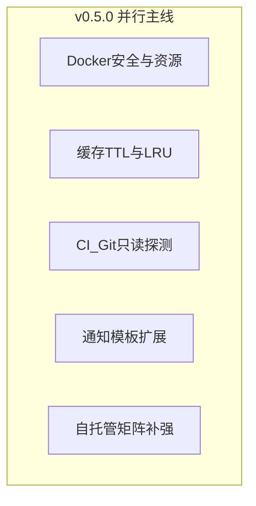

# Shipyard 下一主版本规划（v0.5.0）

## 基线与版本定位

- **基线**：[CHANGELOG.md](../../CHANGELOG.md) **0.4.0**（Docker Linux opt-in、缓存 LRU+上限+Node/`.nvmrc`、预览 health、Linux Nginx 原子写、企业微信、rootless 文档等）。
- **v0.5.0 主题**：**Docker 构建可预期（资源/网络/非特权）**、**依赖缓存 TTL 与 LRU 可组合运营**；**P1** 组织配额、CI smoke、通知模板、自托管矩阵深化。
- **需求规格**：[shipyard-v0.5-需求规格.md](./shipyard-v0.5-需求规格.md)（**P0 仅两条主线**，见规格文首表）。
- **仍不承诺**：多区域 HA、审计、合规、1.0 清单（延续 v0.4 / v0.3 边界）。

## 优先级摘要

| 级别 | 范围 |
|------|------|
| **P0** | FR-DOCKER-V5（非特权、资源、network）；FR-CACHE-V5（MAX_AGE_DAYS + 与 LRU 顺序） |
| **P1** | 组织缓存配额；`GIT_SMOKE_*` CI；通知模板变量；README 自托管列 |
| **Stretch** | BuildCommandExecutor 类 SPI 重构 |

## 主线关系（并行）

## 1. Docker 资源与安全（P0）

- **锚点**：[docker-build.executor.ts](../../apps/server/src/modules/pipeline/docker-build.executor.ts)、[build-worker.service.ts](../../apps/server/src/modules/pipeline/build-worker.service.ts)、[docker-build-flag.ts](../../apps/server/src/modules/pipeline/docker-build-flag.ts)。
- **交付**：默认无 `--privileged`；`--cpus`/`--memory` 与环境变量映射；`--network` 默认值与覆盖；README 与 `.env.example`。

## 2. 依赖缓存 TTL + LRU（P0）

- **锚点**：[build-deps-cache.ts](../../apps/server/src/modules/pipeline/build-deps-cache.ts)、BuildWorker 写入缓存后淘汰调用链。
- **交付**：`SHIPYARD_BUILD_DEPS_CACHE_MAX_AGE_DAYS`；与全局字节上限组合时 **先 TTL 后 LRU**（与需求规格一致）；日志前缀可区分。

## 3. 组织配额 / CI / 通知 / 文档（P1）

- **组织配额**：在 `orgId/pm/fp` 树下限制子树大小或条目数（实现选型见需求规格）。
- **CI**：`.github/workflows/ci.yml` 可选 job + secrets 文档。
- **通知**：`NotificationEnqueue` 与 `notify-worker` 模板渲染层。
- **自托管**：README / README-EN 表增加版本或 issue 链接列。

## 4. Stretch

- **Build SPI**：抽取 Process vs Docker 执行路径，便于测试与后续加策略。

## 工程与文档

- **CHANGELOG**：0.5.0 按模块；Docker 默认行为变化标 **Behavior**。
- **README / README-EN**：与 `.env.example` 同步新变量。

## 建议里程碑

| 阶段 | 内容 |
|------|------|
| 0.5.0-alpha | FR-CACHE-V5 TTL+顺序 + `.env.example` 草案 |
| 0.5.0-beta | FR-DOCKER-V5 默认收紧 + 文档 |
| 0.5.0-rc | P1（配额或 CI 或通知择一打包）+ 全量回归 |

## 落盘与需求规格

- 仓库事实来源：本文件 **shipyard-v0.5-路线图.plan.md**。
- 需求规格：**[shipyard-v0.5-需求规格.md](./shipyard-v0.5-需求规格.md)**。

## 实施待办（YAML 与上表 id 对齐）

| id | 内容 | 默认优先级 |
|----|------|------------|
| `v05-docker-harden` | Docker 非特权、资源、network + 文档 | P0 |
| `v05-cache-ttl-lru` | TTL env、淘汰顺序、日志 | P0 |
| `v05-cache-org-quota` | 组织配额 | P1 |
| `v05-ci-git-smoke` | CI 只读探测 | P1 |
| `v05-notify-templates` | 通知模板 | P1 |
| `v05-doc-selfhosted` | 自托管矩阵列 | P1 |
| `v05-readme-changelog` | CHANGELOG + README | P0 |
| `v05-spi-executor` | Build SPI | Stretch |

---

**下一版本**：见 [shipyard-v0.6-路线图.plan.md](./shipyard-v0.6-路线图.plan.md)（[需求规格](./shipyard-v0.6-需求规格.md)）。
