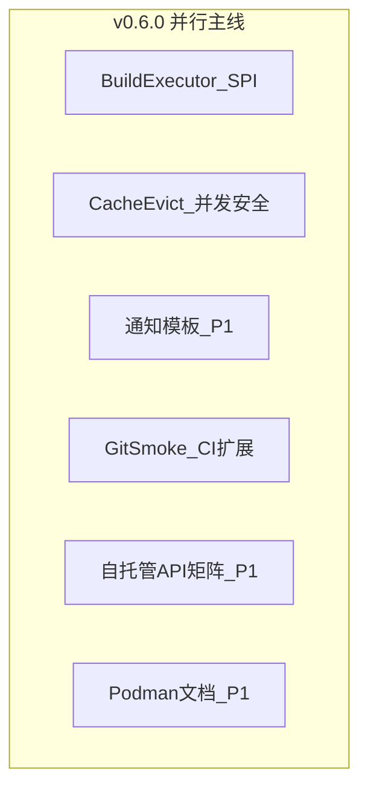

# Shipyard 下一主版本规划（v0.6.0）

## 基线与版本定位

- **基线**：[CHANGELOG.md](../../CHANGELOG.md) **0.5.0**（Docker 资源/网络、TTL→组织 LRU→全局 LRU、通知占位符、`git-smoke`、自托管表与矩阵、组织配额等）。
- **v0.6.0 主题**：**构建执行器 SPI**、**缓存淘汰并发安全**；**P1** 通知模板整包、自托管（CI 与文档 **拆分**）、Podman 文档；**Stretch** Fork 预览。
- **需求规格**：[shipyard-v0.6-需求规格.md](./shipyard-v0.6-需求规格.md)（**P0 仅两条主线**，见规格文首表）。
- **仍不承诺**：多区域 HA、审计、合规、1.0 清单（延续 v0.5 §2.2）。

## 优先级摘要

| 级别 | 范围 |
|------|------|
| **P0** | FR-BUILD-V6（SPI + 单测）；FR-CACHE-V6（evict 路径互斥 + 并发假设文档） |
| **P1** | FR-NOTIFY-V6；FR-CI-V6-001；FR-DOC-V6-001/002/003 |
| **Stretch** | FR-PREVIEW-V6-001 |

## 主线关系（并行）

> 图中 **无先后依赖箭头**：实现顺序由迭代排期决定，以需求规格验收为准。

## 1. 构建执行器 SPI（P0）

- **锚点**：[build-worker.service.ts](../../apps/server/src/modules/pipeline/build-worker.service.ts)、[container-build-runner.types.ts](../../apps/server/src/modules/pipeline/container-build-runner.types.ts)、[docker-build.executor.ts](../../apps/server/src/modules/pipeline/docker-build.executor.ts)（若仍存在编排逻辑则对齐边界）。
- **交付**：进程构建与 Docker 构建可测拆分；对外行为与 v0.5 一致；Vitest。

## 2. 依赖缓存淘汰并发（P0）

- **锚点**：[build-deps-cache.ts](../../apps/server/src/modules/pipeline/build-deps-cache.ts) 中 `evictDepsCacheTtl`、`evictDepsCacheLru`、`evictOrgDepsCacheLru`、`runDepsCacheEvictionPipeline`。
- **交付**：**仅淘汰路径** 互斥；README 写明多 Worker 假设；可选淘汰指标/日志（P1）。

## 3. 通知 / CI / 自托管文档 / Podman（P1）

- **通知**：Prisma 迁移 + API + Web 管理端；与 `renderNotificationPlaceholders` 组合。
- **CI**：扩展 `git-smoke` 多 URL；secrets 与 workflow 文档。
- **自托管文档**：独立脚本或文档矩阵（API 版本），与 CI job **分开验收**。
- **Podman**：双语 README 段落，非运行时强制。

## 4. Stretch

- **Fork 预览**：策略、隔离、资源上限；纳入前单独砍 scope。

## 工程与文档

- **CHANGELOG**：0.6.0 按模块；Behavior 变更标注。
- **README / README-EN**：与 `.env.example`、迁移说明同步。

## 建议里程碑

| 阶段 | 内容 |
|------|------|
| 0.6.0-alpha | FR-CACHE-V6 互斥 + 并发假设文档 + `.env.example` 草案（若有新变量） |
| 0.6.0-beta | FR-BUILD-V6 SPI + Vitest |
| 0.6.0-rc | P1（通知或 CI 或自托管文档择包）+ 全量回归 |

## 落盘与需求规格

- 仓库事实来源：本文件 **shipyard-v0.6-路线图.plan.md**。
- 需求规格：**[shipyard-v0.6-需求规格.md](./shipyard-v0.6-需求规格.md)**。

## 实施待办（YAML 与上表 id 对齐）

| id | 内容 | 默认优先级 |
|----|------|------------|
| `v06-build-spi` | SPI 抽取 + Vitest | P0 |
| `v06-cache-evict-lock` | Evict 路径锁 + README 假设 | P0 |
| `v06-notify-templates` | 通知模板 DB/API/UI | P1 |
| `v06-ci-git-smoke-multi` | CI 多 URL smoke | P1 |
| `v06-doc-git-api-matrix` | API 版本矩阵/脚本 | P1 |
| `v06-doc-podman` | Podman 文档 | P1 |
| `v06-preview-fork` | Fork 预览 | Stretch |
| `v06-readme-changelog` | CHANGELOG + README | P0 |
