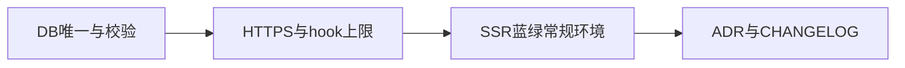

# Shipyard v0.7.0 路线图

## 基线与版本定位

- **基线**：`develop` 已含 **环境级 `releaseConfig`（Zod）**、**EnvironmentServer**、**FeatureFlag / KubernetesCluster API**、**SSH 多机 / 静态蓝绿 / 金丝雀片段 / Prometheus 门禁 / hooks**、**可选镜像 build+push**、**kubectl 部署分支**（见 README「发布策略与环境配置」表）。
- **v0.7.0 主题**：**数据与契约硬化**、**安全基线收紧**、**SSR 常规环境蓝绿与预览语义对齐**、**运维/ADR 文档**，为后续 0.7.x 或 1.0 铺路。
- **仍不承诺**（与 v0.4/v0.3 边界一致）：多区域 HA、完整 GitOps reconcile、审计合规全套；影子流量仍以 runbook 为主。

## 优先级

| 级别 | v0.7.0 范围 |
|------|-------------|
| **P0** | FeatureFlag DB 唯一性；Prometheus `queryUrl` **仅 HTTPS**；hook 输出上限（防日志与 DB 膨胀） |
| **P1** | 常规环境 **SSR + blue_green**（Linux）：双槽 PM2、健康探活、Nginx 反代切换；失败回滚槽位与进程 |
| **P2** | ADR/文档：K8s + registry + kubeconfig 密钥面；CHANGELOG + 版本号 |

## 与路线图原文档的关系

- 附件「发布策略全量路线图」中 **SSR 常规蓝绿**、**门禁 HTTPS**、**hooks 输出长度** 等在 v0.7 显式收口。
- **每目标部署锁**、**并行 rolling** 列为 0.7.x / Stretch（本版本不强制改锁模型，避免与现有 `deploy-lock:${envId}` 行为大改）。

## 并行关系（示意）

