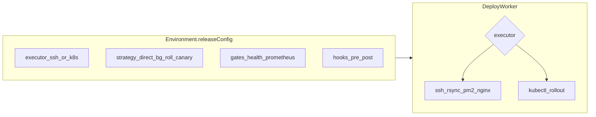

# Shipyard 发布策略扩展路线图（环境级配置）

| 项 | 内容 |
|----|------|
| 文档性质 | 跨版本能力地图（建议在拆 **v0.7+ 需求规格** 时按阶段吸收为 FR） |
| 继承边界 | [shipyard-v0.5-需求规格.md](./shipyard-v0.5-需求规格.md) / [shipyard-v0.6-需求规格.md](./shipyard-v0.6-需求规格.md) §2.2 **Out of Scope**（多区域 HA 等仍不自动承诺） |
| 锚点实现 | [deploy.application.service.ts](../../apps/server/src/modules/deploy/application/deploy.application.service.ts)、[schema.prisma](../../apps/server/prisma/schema.prisma) |

### 审阅修订（相对初稿）

- 修正部署服务文件名为 `deploy.application.service.ts`（非 `deploy.service.ts`）。
- 仓库内链接统一为自本文件出发的相对路径，便于在克隆仓库中点击跳转。
- **FeatureFlag** 若同时支持「组织级 / 项目级」，实现时需注意 Prisma 对 **可空字段唯一约束**（如 `projectId` 为 null 的组织级 key）的建模方式（复合唯一 + 部分索引或分两张表），避免与文档中「示意 unique」字面冲突。

## 目标与边界

- **目标**：用户可在 **项目/环境** 维度选择发布策略与执行面；在能力范围内补齐此前对比中「缺口」里 **可产品化** 的部分。
- **已确认方向**：**SSH 增强 + K8s 可选**；**内置极简 Feature Flag**（API + 管理端，运行时 SDK 可后补）。
- **仍不承诺（与现有规格一致）**：**多区域 HA**、**完整 GitOps 控制器（声明式 reconcile）**、**与外部 CMDB/工单深度集成**；这些仅可作为文档或远期 Stretch。
- **事实来源**：当前生产路径以 [deploy.application.service.ts](../../apps/server/src/modules/deploy/application/deploy.application.service.ts) 中 **单 `serverId` + `deployPath` + Redis `deploy-lock`** + **tar 解压 + rsync** + **HTTP 健康检查 + 自动回滚** 为主；PR 预览 SSR 已有 **双槽 PM2 蓝绿** 可参考同文件 `deployPreview` 与 [schema.prisma](../../apps/server/prisma/schema.prisma) 中 `Preview.ssrBgSlot`。

## 配置模型（统一入口）

建议在 **Environment** 上增加可版本化的 **`releaseConfig`（JSON）**，由服务端 **Zod 校验**，避免无界 JSON。示意结构（实现时再定稿字段名）：

```ts
// 概念模型（非最终代码）
type ReleaseConfig = {
  executor: 'ssh' | 'kubernetes';
  strategy: 'direct' | 'blue_green' | 'rolling' | 'canary';
  // SSH 专用
  ssh?: { slots?: 2; canaryPercent?: number; targets?: Array<{ serverId: string; weight?: number }> };
  // K8s 专用
  kubernetes?: { namespace: string; deploymentName: string; containerName?: string; kubeconfigSecretId?: string };
  // 门禁
  gates?: { prometheus?: { queryUrl: string; maxFailureRatio?: number; window?: string } };
  hooks?: { preDeploy?: string[]; postDeploy?: string[] }; // SSH 上 shell 命令片段，需安全审计
};
```

- **默认**：`executor: 'ssh', strategy: 'direct'` 与 **当前行为** 完全一致（迁移后零配置等价）。
- **校验失败**：环境保存时 400，避免 Worker 运行时才爆炸。

涉及文件：[schema.prisma](../../apps/server/prisma/schema.prisma)、[environments.application.service.ts](../../apps/server/src/modules/environments/application/environments.application.service.ts)、Web 环境相关页（`apps/web`）。

## 分阶段交付（建议版本轴）

### 阶段 A — 内置特性开关（P0，与执行器正交）

- **数据**：`FeatureFlag`（建议字段：`organizationId`、`projectId?`、`key`、`enabled`、`valueJson?`、`updatedAt`）；组织级与项目级唯一性见上文「审阅修订」。
- **API**：组织/项目维度 CRUD；**只鉴权不改部署路径**（先解决「发布与曝光解耦」的最小闭环）。
- **Web**：项目或组织设置页简单表格 + 开关。
- **后续（可选）**：`@shipyard/shared` 提供 **构建期替换占位** 或 **SSR 运行时拉取缓存** 的文档与示例，不阻塞本阶段。

### 阶段 B — SSH：`direct` 保持 + `blue_green`（P0/P1）

- **静态 / SSR 常规环境**：复用预览里 **双槽位 + 健康检查再切换** 的思路，抽象为 **「环境级蓝绿」**（例如 `deployPath-blue`/`deployPath-green` 或固定子目录 `releases/current|next`，由 `releaseConfig` 约定）。
- **与现有自动回滚对齐**：失败路径仍走 `triggerAutoRollback` 思想；蓝绿切换失败应 **回退到旧槽** 而非仅删锁。
- **日志阶段标记**：部署日志增加 `candidate_up`、`health_ok`、`traffic_switch`、`rollback` 等前缀（与 v0.3 规格表一致方向）。

### 阶段 C — SSH：`rolling` + 多目标（P1）

- **数据**：从单 `serverId` 演进为 **`EnvironmentServer`**（`environmentId`、`serverId`、`order`、`weight`），保留原 `serverId` 作为 **主节点 / 兼容迁移**（迁移脚本：每环境一条 `EnvironmentServer` 指向原 server）。
- **行为**：按 `order` **串行 rsync**（或并行 + 最后统一 reload），每台 **同一 `deployPath` 结构**；**Nginx upstream** 若有多台需 **指定哪台持有 nginx 配置**（`primaryServerId` 或在 `releaseConfig` 标明）。
- **风险**：多机 Nginx 一致性需 **明确运维契约**（文档 + 验收用例）。

### 阶段 D — SSH：`canary`（P2，依赖负载均衡能力）

- **最小可行**：在 **持有 Nginx 的入口机** 上，由 Shipyard **下发/更新** 带 `split_clients` 或 **upstream weight** 的片段（类似预览 **原子写**），`canaryPercent` 来自 `releaseConfig`。
- **限制**：若用户 **无独立入口 LB**，则策略降级为文档说明「仅双实例 + DNS/外部 LB」或禁用 canary 并提示。

### 阶段 E — 门禁扩展：`prometheus`（P2）

- **配置**：`releaseConfig.gates.prometheus`：Worker 在 **HTTP health 通过后**（或替代）对 **只读 query API** 拉取指标，解析简单规则（错误率阈值）；失败则 **阻断切换** 或 **触发自动回滚**。
- **安全**：仅允许 HTTPS、内网 URL；与现有 [outbound-url-guard.ts](../../apps/server/src/modules/notifications/outbound-url-guard.ts) 一类逻辑对齐，防 SSRF。

### 阶段 F — Hooks（P2）

- **配置**：`preDeploy` / `postDeploy` **命令列表**（在 **目标机** 上执行，chroot 到 `deployPath` 或显式 cwd）；**必须**限制超时、输出长度、禁止交互；敏感操作需 **角色 + 环境保护** 双检。

### 阶段 G — Kubernetes 执行器（P1–P2，依赖镜像流水线）

当前产物为 **tarball**，与 K8s **镜像部署** 不直接兼容，需 **并行增加镜像制品路径**：

1. **构建**：在 [build-worker.service.ts](../../apps/server/src/modules/pipeline/build-worker.service.ts) / PipelineConfig 增加 **可选** `containerImageEnabled`、`imageName`、`registryAuth`（加密存储）；构建成功后 **`docker build` + `docker push`**（与现有 Docker 执行器共用 Linux 前提）。
2. **制品**：`BuildArtifact` 或 Deployment 记录 **image digest**；部署 Job 按 `executor` 分支：**SSH 仍走 tar**，**K8s 走 kubectl**。
3. **凭据**：`Server` 扩展或独立 `KubernetesCluster` 实体存 **加密 kubeconfig**；**仅 Deploy Worker 可解密**。
4. **策略**：K8s 上 `rollingUpdate` 由 **Deployment 自身** 完成；Shipyard 负责 **apply manifest / set image / rollout status**；**金丝雀** 可优先用 **原生 `maxUnavailable`/`maxSurge`** 或后续接 **Argo Rollouts** 作为 Stretch（不强制自研）。

### 阶段 H — 明确不做或仅文档（Stretch）

| 能力 | 处理 |
|------|------|
| **完整 GitOps** | 提供 **只读导出 YAML**（项目/环境快照）可选；双向 reconcile 不纳入本路线图主路径。 |
| **影子流量** | 依赖 Nginx `mirror` 或 Mesh；以 **运维 Runbook** + 可选脚本为主，避免首版强绑产品逻辑。 |
| **多区域 HA** | 维持规格 **Out of Scope**。 |

## 架构关系（概念）



## 文档与验收

- 更新 [README.md](../../README.md) / [README-EN.md](../../README-EN.md)：策略矩阵、前置条件（LB、Docker、K8s）、**降级行为**。
- 每阶段 **§ 验收表**：等价于「旧环境零配置行为不变」+ 新策略最小 E2E 或脚本。

## 风险与依赖

- **K8s + 镜像**：显著增加 **密钥面（registry + kubeconfig）** 与 **Worker 权限**；需 **ADR 级** 说明。
- **Nginx 动态片段**：错误配置可导致 **整站不可用**；必须 **原子写 + 备份回滚**（与预览同套路）。
- **多 Server 滚动**：与 **单锁** 模型冲突时需升级为 **每目标锁** 或 **编排锁**，避免死锁。

## 修订记录

| 日期 | 说明 |
|------|------|
| 2026-04-11 | 审阅后落盘至 `.cursor/plans/`，修正链接与 FeatureFlag 唯一性实现提示 |
