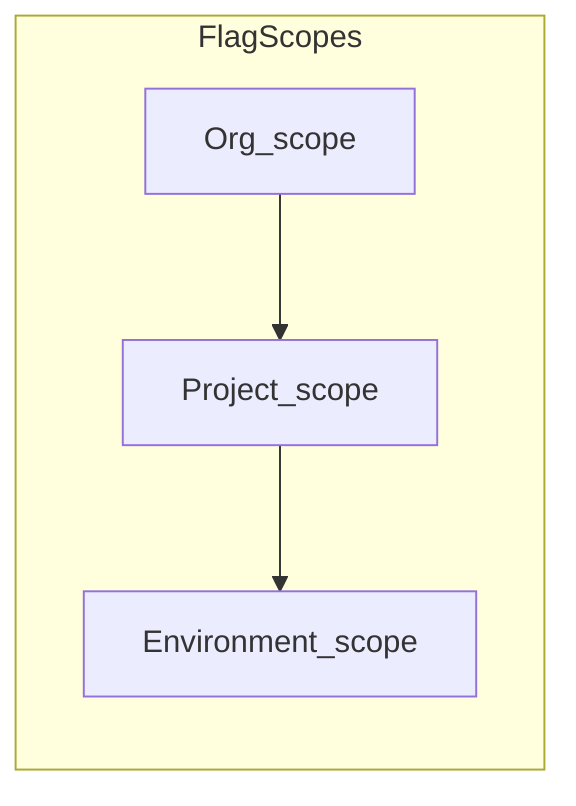

# 环境级特性开关实现计划

**关联需求规格**：[shipyard-环境特性开关-需求规格.md](./shipyard-环境特性开关-需求规格.md)（验收与 FR/NFR 以需求规格为准。）

## 背景与目标

当前 [FeatureFlag](../../apps/server/prisma/schema.prisma) 仅支持 `organizationId` + 可选 `projectId`（见 [feature-flags.application.service.ts](../../apps/server/src/modules/feature-flags/application/feature-flags.application.service.ts)）。目标是增加**第三层作用域：某一部署环境内**的同名 key 唯一，与组织级、项目级并列；**本期只做管理面 CRUD**（与 README 中「与部署路径解耦」一致），不强制实现「组织/项目/环境合并 resolve」运行时 API——若后续部署或 SDK 需要，可单开需求。

## 数据模型

- 在 `FeatureFlag` 上增加可选字段 **`environmentId String?`**，外键指向 [Environment](../../apps/server/prisma/schema.prisma)（`onDelete: Cascade`），并在 `Environment` 上增加反向关系 `featureFlags`。
- **行语义约定**（应用层校验，避免非法组合）：
  - **组织级**：`projectId == null` 且 `environmentId == null`（与现有一致）。
  - **项目级**：`projectId != null` 且 `environmentId == null`。
  - **环境级**：`environmentId != null`；同时写入 **`projectId`** = 该环境所属项目（便于鉴权与列表过滤，且与「环境属于项目」一致）。
- **PostgreSQL 部分唯一索引**（需新迁移；并**修正**现有项目级索引条件）：
  - 组织级：`(organizationId, key)` WHERE `projectId IS NULL AND environmentId IS NULL`（建议在迁移里为组织级索引补上 `environmentId IS NULL`，与新增列后的语义一致）。
  - 项目级：`(projectId, key)` WHERE `projectId IS NOT NULL AND environmentId IS NULL`（**关键**：替换当前迁移 [20260411220000_feature_flag_partial_unique](../../apps/server/prisma/migrations/20260411220000_feature_flag_partial_unique/migration.sql) 中仅 `projectId IS NOT NULL` 的定义，否则环境级行若带同一 `projectId` 会与项目级 `(projectId, key)` 冲突）。
  - 环境级：`(environmentId, key)` WHERE `environmentId IS NOT NULL`。

## 后端 API

- 控制器 [feature-flags.controller.ts](../../apps/server/src/modules/feature-flags/feature-flags.controller.ts)：在现有 `projectSlug` 查询参数基础上，增加可选 **`environmentName`**（或 `environment`）：**仅当提供 `projectSlug` 时合法**；用于 list/create 时锁定环境。
- [FeatureFlagsApplicationService](../../apps/server/src/modules/feature-flags/application/feature-flags.application.service.ts)：
  - 新增 `getEnvironmentId(orgId, projectSlug, envName)`：校验项目属于组织且环境 `@@unique([projectId, name])` 命中。
  - `listFlags`：`environmentName` 有值时 `where: { organizationId, projectId, environmentId }`；无 `environmentName` 时保持现有组织/项目列表行为（`environmentId: null`）。
  - `createFlag` / `updateFlag`：在环境级下校验 **environment.projectId === row.projectId**；重名检测按「同作用域」：`organizationId+projectId+environmentId` 与 `key` 组合（与唯一索引一致）。
  - `updateFlag` 修改 `key` 时的冲突检测需使用行上实际 `projectId` / `environmentId`。
- 列表/详情 **`select` 中增加 `environmentId`**（便于前端展示当前作用域）。

## 前端 Web

- [apps/web/src/api/feature-flags/index.ts](../../apps/web/src/api/feature-flags/index.ts)：`listFeatureFlags` / `createFeatureFlag` 增加可选 `environmentName`；`FeatureFlagRow` 增加可选 `environmentId`。
- UI 方案（推荐，改动集中）：在 [ProjectDetailPage.vue](../../apps/web/src/pages/projects/ProjectDetailPage.vue) 的「特性开关」Tab 内，用 **作用域选择**（`n-select`：「项目级」+ 各 `project.environments[].name`）驱动 [ProjectFeatureFlagsPanel.vue](../../apps/web/src/pages/projects/components/ProjectFeatureFlagsPanel.vue)；根据选择传 `environmentName` 或仅 `projectSlug`。文案区分「项目级」与「某环境」；表格与弹窗逻辑与现有一致。

## 小程序 MP

- [apps/mp/src/api/feature-flags.ts](../../apps/mp/src/api/feature-flags.ts) 与 [ProjectFeatureFlagsTab.vue](../../apps/mp/src/package-org/components/ProjectFeatureFlagsTab.vue) 做与 Web 相同的查询参数与作用域选择，保持行为对齐（参见 CHANGELOG 对 MP 与 Web 对齐的约定）。

## 文档与测试

- 更新 [README.md](../../README.md) / [README-EN.md](../../README-EN.md) 中特性开关说明：支持**环境级**及 API 查询参数。
- 建议为 `FeatureFlagsApplicationService` 增加**单元测试**（组织/项目/环境 list 过滤、环境级 create 重复 key、非法组合 `environmentName` 无 `projectSlug`），放在 `apps/server/src/modules/feature-flags/` 下，与仓库现有 Vitest 风格一致。

## 审阅备忘（结论与实现时注意）

- **结论**：方案可执行；单表加 `environmentId` + 三条部分唯一索引与现有组织/项目两级模型一致，且**必须**收紧项目级索引条件，否则环境级行会与项目级唯一冲突。
- **数据安全**：新增列默认 `NULL`，现有行无需回填；迁移顺序建议：加列与外键 → DROP 旧两条部分唯一索引 → CREATE 三条新索引（组织级条件含 `environmentId IS NULL`）。
- **API 形态**：`environmentName` 与环境中 `name` 对齐（同 [EnvVariable](../../apps/server/prisma/schema.prisma) 按环境维度操作的习惯）；若仅传 `environmentName` 不传 `projectSlug` 应 **400**。
- **边界**：环境重命名后，客户端需用新 `name` 拉列表；行仍挂在 `environmentId` 上，数据不丢。删除环境级联删除 flag，符合预期。
- **范围确认**：本期不含「合并 resolve」与流水线读 flag；若上线后立刻要在 Worker 里用，需另排期只读 API 或配置注入。

## 明确不纳入本期（可后续立项）

- **运行时合并**：按 `环境 > 项目 > 组织` 解析最终 `enabled`/`valueJson` 的只读 API 或 Worker 注入。
- **部署流水线自动读 flag**：仍与当前「特性开关与部署解耦」策略一致。
