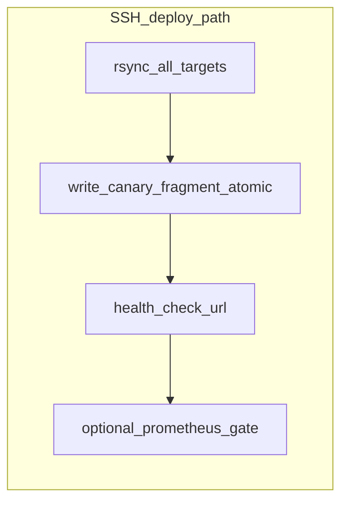

# 金丝雀发布（Canary）规划

## 审阅记录

- **结论**：用户审阅 **无补充**，按本稿进入 **需求规格 → 路线图**（仓库 [`.cursor/plans/`](.)，可提交共享）。
- **待决项**：下列条目不在本规划层强行拍板，**须在 `shipyard-金丝雀发布-需求规格.md` 中写成明确 FR/验收**（可附「缺省建议」供实现）。

## 现状摘要（代码事实）

- **配置模型**：[`apps/server/src/modules/environments/domain/release-config.schema.ts`](../../apps/server/src/modules/environments/domain/release-config.schema.ts) 含 `strategy: 'canary'`、`ssh.canaryPercent`、`nginxCanaryPath`、`nginxCanaryBody`；`canaryPercent` **未被部署逻辑消费**。
- **执行路径**：[`apps/server/src/modules/deploy/application/deploy.application.service.ts`](../../apps/server/src/modules/deploy/application/deploy.application.service.ts) 在非蓝绿分支 rsync 后，若 `canary` + Linux + `nginxCanaryPath` + `nginxCanaryBody`，调用 `sshWriteCanaryNginxAtomic`；否则仅日志说明。
- **K8s**：`performKubernetesRollout` 不区分 `strategy`（全量 `set image` + `rollout status`）。
- **管理端**：[`apps/web/src/pages/projects/components/EnvironmentModal.vue`](../../apps/web/src/pages/projects/components/EnvironmentModal.vue) 仅整段 `releaseConfig` JSON。
- **历史边界**：[shipyard-v0.7-需求规格.md](./shipyard-v0.7-需求规格.md) §5 已排除「按 canaryPercent 自动生成片段」；本专题为后续交付。

## 需求规格阶段必须写清的条目（来自审阅）

1. **Nginx 默认模式**：在 FR 中 **选定一种默认**（建议缺省：`split_clients` + 双 `upstream`）；另一种标为 Stretch 或仅「高级手动 body」。
2. **`nginxCanaryBody` vs 生成片段**：**唯一优先级规则**（建议缺省：若 `nginxCanaryBody` 非空则完全使用手写，忽略生成器；否则用生成器）。
3. **`nginx -t` 失败与磁盘状态**：现有脚本为 `mv` 最终文件后再 `nginx -t`。需求须明确：接受「新文件已落地但未 reload」、或要求 **备份/两阶段 swap** 失败则恢复旧文件（验收与实现一致）。
4. **多机**：明确 **仅入口机**（`primaryServerId` 或第一台）写金丝雀片段，其余机仅 rsync。
5. **健康/Prometheus 失败**：是否与 **回滚 Nginx 片段** 联动，或仅触发既有部署回滚 + 文档说明运维手顺。

## 目标与不做

**目标（P0/P1）**

1. `canaryPercent` + 契约字段 → 服务端生成合法片段，走现有原子写入；日志阶段可辨（如 `canary_fragment_generated` / `traffic_switch`）。
2. README / runbook：`include` 方式、`upstream` 命名约定。
3. 环境保存时校验完整，避免部署时才失败。

**不做（首期 Stretch）**

- K8s 加权 / Argo Rollouts / Flagger 内建。
- 多区域、GitOps reconcile、影子流量（同 README Stretch）。
- 自动「晋升全量」「一键回退流量」无独立 FR 前不承诺。

## 技术方向（SSH / Nginx）

- **`split_clients` + 两个 `upstream`**（稳定 / 候选），比例映射 `canaryPercent`；或
- **`upstream` 内 `server` `weight`**（稳定与候选须不同 backend）。

**语义**：首期文档写清——当前 canary = **入口流量比例**，假设 stable/canary upstream **已指向正确后端**；「仅候选机新版本」需蓝绿/多目标分工，列 P2/Stretch。

## 文档落盘（shipyard-plan-workflow）

1. [shipyard-金丝雀发布-需求规格.md](./shipyard-金丝雀发布-需求规格.md)（尚未创建）
2. [shipyard-金丝雀发布-路线图.plan.md](./shipyard-金丝雀发布-路线图.plan.md)（尚未创建）

可选：改为 `shipyard-v0.8-需求规格.md` 等版本文件名，正文单列金丝雀章节。

## 实现锚点

| 区域 | 文件 |
|------|------|
| schema | [`release-config.schema.ts`](../../apps/server/src/modules/environments/domain/release-config.schema.ts)、[`release-config.validation.ts`](../../apps/server/src/modules/environments/application/release-config.validation.ts) |
| 部署 | [`deploy.application.service.ts`](../../apps/server/src/modules/deploy/application/deploy.application.service.ts) |
| Web | [`EnvironmentModal.vue`](../../apps/web/src/pages/projects/components/EnvironmentModal.vue) |
| 文档 | [`README.md`](../../README.md)、[`README-EN.md`](../../README-EN.md) |
| 继承 | [shipyard-发布策略扩展-路线图.plan.md](./shipyard-发布策略扩展-路线图.plan.md) 阶段 D |

## 分阶段（路线图 todos）

1. **P0**：片段生成纯函数 + schema/保存校验 + deploy 串联；手写 body 覆盖规则按需求定稿。
2. **P1**：Web 表单（百分比、路径、上游名/模板）。
3. **P2**：日志前缀统一、失败与片段回滚/运维说明、与 Prometheus 顺序是否可配置。
4. **Stretch**：`executor: kubernetes` + `strategy: canary` 行为（显式拒绝或外部方案）。

## 验收要点（草案）

- 仅契约字段 + `canaryPercent`、无 `nginxCanaryBody` 时，Linux 入口机写入并重载成功；行为与「`nginx -t` 失败」验收条与 §写清条目 3 一致。
- 同时提供生成字段与 `nginxCanaryBody` 时符合文档唯一规则。
- 配置不完整时 **保存环境 400**。
- 兼容原双字段手写配置。
