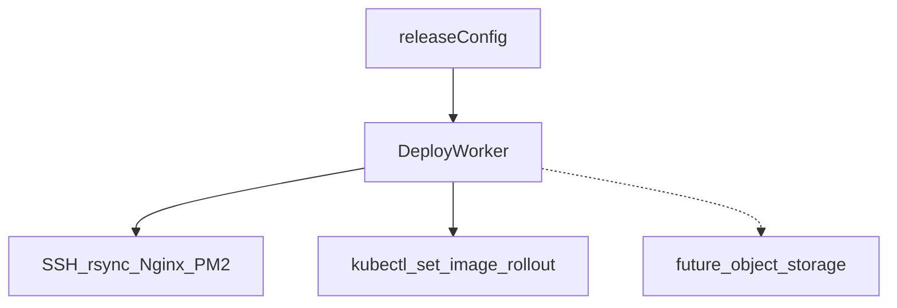

# 与现有架构最顺的发布策略扩展规划

## 架构约束（保持）

- 统一配置：[release-config.schema.ts](../../apps/server/src/modules/environments/domain/release-config.schema.ts) + [release-config.validation.ts](../../apps/server/src/modules/environments/application/release-config.validation.ts)（`validateAndNormalizeReleaseConfig`）。
- 执行入口：[deploy.application.service.ts](../../apps/server/src/modules/deploy/application/deploy.application.service.ts) 内 `executor` 分支（SSH rsync / PM2 / Nginx vs `performKubernetesRollout`）。
- 制品：SSH 仍以 **构建 tarball** 为主；K8s 以 **镜像 ref/digest** 为主（[schema.prisma — PipelineConfig](../../apps/server/prisma/schema.prisma) 中 `containerImageEnabled`）。

## 轴线 A — SSH / Nginx（与金丝雀、蓝绿同一平面）

**为何最顺**：已有 [deploy.application.service.ts](../../apps/server/src/modules/deploy/application/deploy.application.service.ts) 内 `sshWriteCanaryNginxAtomic`、备份恢复、[canary-nginx-fragment.ts](../../apps/server/src/modules/deploy/domain/canary-nginx-fragment.ts) 生成器模式；只需 **第二套模板 + 可选枚举字段**，不必新执行器。

**建议交付**

1. **P0**：在 `ssh` 下增加可选 `nginxCanaryTemplate: 'split_clients' | 'upstream_weight'`（默认 `split_clients` 保持兼容）。`upstream_weight` 分支生成「双 `server` + `weight`」的 `upstream` 片段（需补充契约字段：例如在**同一 upstream 名**下 stable/candidate 的 `host:port` 或引用已有 upstream 的文档约定——在需求规格里二选一并写验收）。
2. **P1**：与 [EnvironmentModal.vue](../../apps/web/src/pages/projects/components/EnvironmentModal.vue) 金丝雀区联动：模板下拉 + 按模板展示字段。
3. **文档**：扩展 [canary-nginx.md](../../docs/runbooks/canary-nginx.md) 与 README 表一行。

**不做（本期）**：OpenResty lua、与 `blue_green` 自动编排（仅文档说明组合方式）。

## 轴线 B — Kubernetes 原生渐进（不引入 Argo 二进制前）

**为何最顺**：[deploy.application.service.ts](../../apps/server/src/modules/deploy/application/deploy.application.service.ts) 中 `performKubernetesRollout` 已集中 `kubectl`；镜像与 kubeconfig 链路不变。

**建议交付**

1. **P0**：`kubernetes` 增加可选 `rolloutTimeoutSeconds`（上限封顶，默认保持 `10m` 行为）或 `maxUnavailable`/`maxSurge` 的 **patch 后再 set image**（`kubectl patch deployment/... --type=strategic`），使「滚动」与 UI 上 `strategy: rolling` 在 K8s 执行器上有语义（当前 K8s 路径**未区分** strategy，可在需求规格中定义：`rolling` = patch 策略 + set image + `rollout status`；`direct` = 仅 set image + status）。
2. **P1**：保存时校验 patch 字段与集群资源存在性（可选，或仅 Zod 范围校验降低耦合）。
3. **Stretch**：`Rollout` CR + 集群内安装 **Argo Rollouts kubectl 插件** 的 `kubectl argo rollouts ...` 封装——单独需求规格（RBAC、插件可用性探测、失败降级）。

**明确边界**：Argo CD / Flux **GitOps reconcile** 仍建议运维侧自建，Shipyard 只保留 webhook/状态回调类集成（与 README Stretch 一致）。

## 轴线 C — 静态站对象存储（新 `executor`，复用 Worker 模型）

**为何较顺**：仍是 **Deploy Job → Worker 解压/同步 → 健康/门禁**；与 SSH 差异在「最后一步」从 rsync 换为 **官方 CLI**（`aws s3 sync`、`rclone` 等），凭据可走现有 **加密字段 + 组织级密钥** 模式（对齐 K8s kubeconfig / registry auth 做法）。

**建议交付**

1. **P0**：`executor: 'object_storage'`（或 `ssh` 子模式，优选独立 executor 避免与 `deployPath` 语义冲突）+ Zod：`provider`、`bucket`、`prefix`、`region?`、密文 `credentialsEncrypted`（或引用组织 `Secret` 模型若已有）。
2. **P0**：Worker 检测 CLI 可用性；同步后可选 **HEAD 探活 URL**（沿用 `healthCheckUrl`）。
3. **P1**：Web 环境表单或 JSON 文档模板；README 矩阵一行。

**不做（首期）**：CDN 自动失效（可 Stretch：`distributionId` + invalidate API）。

## 审阅修订（须在需求规格中写清）

1. **轴线 B — patch 与 GitOps / 外部控制器**：若 Deployment 由 Helm、Argo CD、Kustomize 等持续 reconcile，对 `strategy` 的 `kubectl patch` 可能在下一轮同步中被覆盖。需求规格须定义 **适用前提**（例如仅适用于「集群内该资源以 Shipyard 为期望真相源」），或 **P0 只增加 `rolloutTimeoutSeconds` 等不改变 RollingUpdate 字段**、patch 策略放到 P1 并文档警示冲突风险。
2. **轴线 B — `executor: kubernetes` 时的 `strategy` 矩阵**：用表格明确 **`direct` / `rolling`** 的语义与日志；**`blue_green` / `canary`** 在 K8s 执行器下须 **保存时 400**（与现有「K8s + canary」拒绝一致），避免与 SSH 策略同名却无语义。
3. **轴线 A — `upstream_weight` 契约**：在 FR 中 **二选一定稿**：（a）生成片段内写全 `upstream` 块及两条 `server host:port` + `weight`；（b）仅生成/更新 weight 行，后端地址由运维在主配置维护。须附 **include + `proxy_pass` 完整示例**，并与现有 `split_clients` + `$shipyard_canary_pool` 文档分区说明，避免读者混用。
4. **轴线 C — 凭据与 NFR**：对象存储密钥与 kubeconfig 同级；规格中补充 **轮换与审计期望**、**部署日志禁止输出明文密钥**、**P0 是否仅支持单一协议族**（例如先做 S3 兼容 API，OSS 专有签名后续版本）以控制范围。

## 协作落盘

- 仓库内事实来源：**本文件** [.cursor/plans/shipyard-顺架构发布策略扩展.plan.md](./shipyard-顺架构发布策略扩展.plan.md)。若 Cursor 在 `~/.cursor/plans/` 另有副本，以仓库内为准或定期合并。
- 正文内代码链接使用 **标准 Markdown 链接**（勿整段包在反引号内），便于在 IDE/Git 中跳转。

## 文档与版本流程

按项目 Skill [shipyard-plan-workflow](../skills/shipyard-plan-workflow/SKILL.md)：审阅通过后 **先** `shipyard-顺架构发布策略-需求规格.md`（或按轴线拆 FR），**再** `shipyard-顺架构发布策略-路线图.plan.md` 互链；实现以需求规格验收表为准。

## 推荐排序（性价比）

| 顺序 | 轴线 | 理由 |
|------|------|------|
| 1 | A 第二 Nginx 模板 | 代码面最小，与金丝雀完全同构 |
| 2 | B 原生 rollout/patch | 只动 K8s 单函数与 schema，无新二进制 |
| 3 | C 对象存储 | 新执行器，但流水线与 Job 形状不变 |

若排期只够一条：**优先 A**；若团队以 K8s 为主：**优先 B 的 P0（strategy 语义 + 超时/滚动参数）**。
